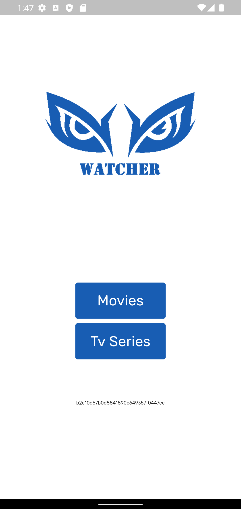
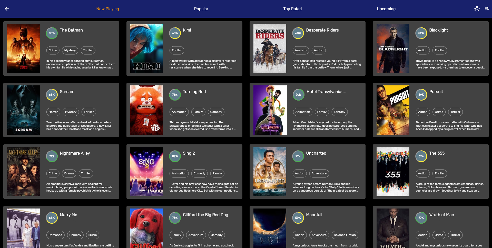

# Watcher with Flutter GetX

Movie & Tv Series Application example with GetX State, Route & Dependency Managements

Register and get Api Key from [The Movie DB Website](https://www.themoviedb.org)

After that in url.dart, change `YOUR_API_KEY`  with your key.

Available in Mobile, Tablets & Web.

***Mobile*** 

  
   
  
  

**Dark**

  
   
  

***Web***

 |

**Dark**

  

***Responive***

 

